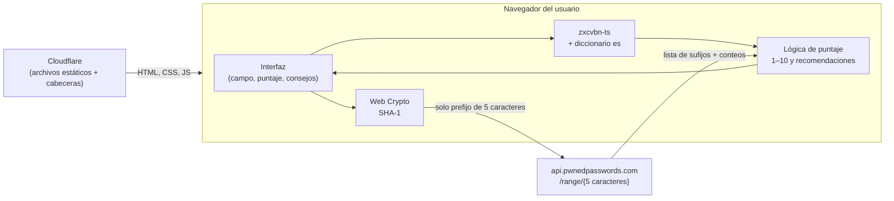
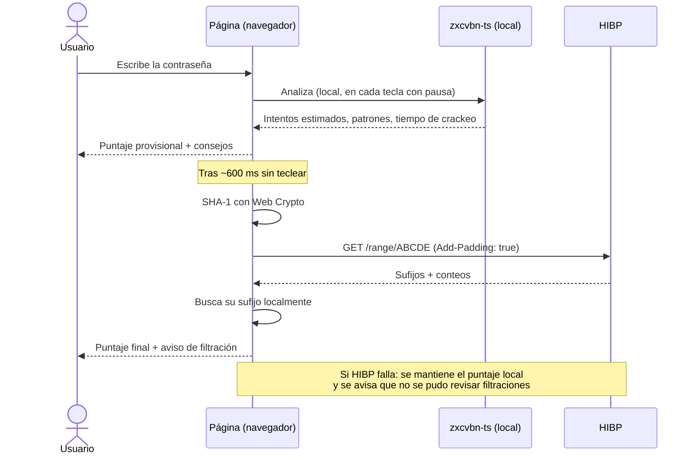
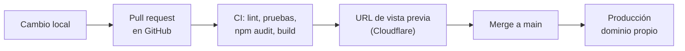

# Brief: Verificador de contraseñas para la comunidad

**Fecha:** 3 de octubre de 2026 · **Autor:** Antonio · **Estado:** propuesta, pendiente de validar decisiones abiertas (sección 13)

> El nombre del producto está pendiente. En este documento se usa "el verificador".

---

## 1. Resumen

Una página web pública donde cualquier persona de la comunidad escribe una contraseña y recibe:

1. Una **puntuación del 1 al 10**.
2. Un aviso de si esa contraseña **aparece en filtraciones reales** y cuántas veces.
3. **Recomendaciones concretas en español** para mejorarla.

El principio que gobierna todas las decisiones: **la contraseña nunca sale del navegador del usuario.** No hay backend propio; el sitio son archivos estáticos servidos por Cloudflare.

La página acompaña un video. La idea nació de la API de pruebas del MC. José Alonso Macías Montoya (Universidad Politécnica de Chiapas), a quien se le da crédito.

## 2. Objetivos y alcance

### Objetivos

- Que el usuario entienda en segundos qué tan segura es su contraseña y qué cambiar.
- Que la privacidad sea **demostrable**, no una promesa: cualquiera puede abrir la pestaña de red y comprobarlo.
- Que el sitio aguante el pico de tráfico del video sin intervención ni costo.

### Dentro del alcance (v1)

- Campo de contraseña con análisis en vivo.
- Puntuación 1–10, tiempo estimado de crackeo, consulta de filtraciones.
- Recomendaciones en español.
- Sección "cómo funciona / por qué es seguro".
- Créditos y aviso de privacidad breve.

### Fuera del alcance (v1)

- Cuentas de usuario, historial, guardado de resultados.
- Backend, base de datos, contador de usos, captura de correos.
- Generador de contraseñas (candidato para v2).
- Consulta de filtraciones por correo electrónico (requiere API de pago de HIBP).

## 3. Análisis realizado

### 3.1 API del profesor (`alonsomaciasm/password-tester-api`)

Se clonó el repositorio, se revisaron código y documentación, y se levantó localmente. Arranca, descarga el diccionario, indexa y responde correctamente.

| Aspecto | Hallazgo | Impacto para esta idea |
|---|---|---|
| Medidor de fuerza | Solo recibe longitud y tipos de caracteres, no la contraseña. `password` sale "MODERATE"; `Password123!` saldría fuerte. | Una puntuación 1–10 basada en esto sería engañosa. **Descalificante.** |
| Base de filtraciones | Lista de 1 millón de contraseñas comunes (SecLists), no filtraciones reales. El conteo casi siempre es 1. | Solo permite decir "es común", no "fue filtrada". |
| Análisis de patrones | zxcvbn está en el código pero no expuesto en la API REST. | No aprovechable sin modificarla. |
| Hash | SHA-256 con prefijo de 5 caracteres. | No compatible con HIBP (SHA-1). |
| Recursos | ~1.1 GB de RAM al indexar, ~170 MB en disco, límite Docker de 1 GB. | Exige servidor de pago con volumen persistente. |
| Arranque | Mientras indexa responde vacío, y ese vacío queda en caché hasta reiniciar. | Riesgo de falsos "segura" tras un reinicio. |
| Seguridad por defecto | Token admin de ejemplo funcional, CORS `*`, `/metrics` y `/stats` públicos. | Requiere endurecer antes de exponer. |
| Logs | Guardan IP y prefijo consultado. | Quien la despliega es responsable ante la LFPDPPP. |
| Licencia | MIT con petición de atribución al autor y a la universidad. | Uso permitido; se da crédito. |

**Conclusión:** es buen material didáctico y explica bien el k-anonimato, pero no es la base adecuada para un producto público con puntuación.

### 3.2 Alternativas evaluadas

| Opción | Calidad del puntaje | Filtraciones | Privacidad | Costo / operación | Veredicto |
|---|---|---|---|---|---|
| A. Desplegar la API del profesor | Baja (solo entropía) | 1 M de contraseñas comunes | Buena, pero hay servidor propio con logs | Servidor ≥1 GB RAM, mantenimiento | Descartada |
| B. Backend propio nuevo | Alta (si integra zxcvbn) | Depende de la fuente | Requiere que el usuario confíe en el servidor | Servidor o funciones, mantenimiento | Descartada: no aporta nada que el navegador no pueda hacer |
| **C. Sitio estático + zxcvbn-ts + HIBP** | **Alta** | **Cientos de millones, reales** | **Demostrable: no hay servidor propio** | **Gratis, sin mantenimiento** | **Elegida** |

## 4. Decisiones y justificación

| # | Decisión | Justificación |
|---|---|---|
| D1 | **Sin backend propio.** | La contraseña no tiene por qué viajar. Sin servidor no hay nada que filtrar, registrar ni hackear, y el argumento de privacidad es verificable. |
| D2 | **zxcvbn-ts** para la fuerza. | Detecta lo que la entropía no ve: palabras de diccionario, patrones de teclado, fechas, sustituciones (`P@ssw0rd`), repeticiones. Tiene diccionario en español y estima tiempo de crackeo. Versión mantenida del zxcvbn de Dropbox. |
| D3 | **HIBP Pwned Passwords** para filtraciones. | Gratis, sin API key, k-anonimato (solo viajan 5 caracteres del SHA-1), base de filtraciones reales, llamable directo desde el navegador. |
| D4 | **Puntaje 1–10 propio** que combina ambas señales. | zxcvbn da 0–4, demasiado grueso. Una contraseña filtrada debe quedar baja aunque "parezca" fuerte. |
| D5 | **Librerías empaquetadas en el build**, cero scripts de terceros. | En una página donde se escriben contraseñas, cualquier script externo es un posible ladrón de teclas. |
| D6 | **Cloudflare** como hosting. | Plan gratuito, CDN global, HTTPS automático, cabeceras de seguridad por archivo `_headers`, soporta picos de tráfico. |
| D7 | **Vite + TypeScript sin framework.** | Es una sola pantalla. Menos dependencias = menos superficie de ataque y página más ligera. (Ver decisión abierta P2.) |
| D8 | **Sin analíticas en v1.** | Ningún script que pueda leer el campo. Si se necesitan métricas, usar las del lado servidor de Cloudflare. (Ver P4.) |
| D9 | **Crédito al profesor** en el sitio y en el video. | La idea nace de su API, la licencia lo solicita, y es lo correcto. |

## 5. Arquitectura

### 5.1 Componentes



Lo único que cruza la red son **5 caracteres hexadecimales** de un hash. Cada prefijo corresponde a cientos de contraseñas distintas, así que HIBP no puede saber cuál se consultó.

### 5.2 Flujo de una verificación



### 5.3 Cálculo del puntaje (propuesta inicial)

1. **Base por fuerza:** a partir de `guessesLog10` de zxcvbn (orden de magnitud de intentos necesarios).

   `base = limitar(techo(guessesLog10 / 1.4), 1, 10)`

   | Intentos estimados | Puntaje base | Lectura |
   |---|---|---|
   | < 10⁴ | 1–2 | Se adivina al instante |
   | 10⁴ – 10⁷ | 3–5 | Débil |
   | 10⁷ – 10¹⁰ | 6–7 | Aceptable |
   | 10¹⁰ – 10¹³ | 8–9 | Fuerte |
   | ≥ 10¹³ | 10 | Excelente |

2. **Tope por filtración:**
   - Aparece en HIBP → máximo **2**.
   - Aparece más de 100 veces → **1**.

3. **Recomendaciones:** se generan a partir de los patrones que detecta zxcvbn (palabra de diccionario, fecha, secuencia de teclado, repetición, sustitución obvia, longitud corta), con textos propios en español. Máximo 3 a la vez, la más importante primero.

Los umbrales se calibran con una lista de contraseñas de prueba antes de publicar (sección 11).

## 6. Seguridad

### 6.1 Reglas que no se negocian

1. La contraseña **nunca** se envía, se guarda ni se registra. Vive solo en memoria de la pestaña.
2. **Nada de almacenamiento:** ni `localStorage`, ni `sessionStorage`, ni cookies, ni parámetros en la URL.
3. **Cero scripts de terceros.** Todo el JS sale del propio dominio.
4. La **única** conexión saliente permitida es a `api.pwnedpasswords.com`.
5. Ningún `console.log` ni reporte de errores que incluya el valor del campo.

### 6.2 Amenazas y mitigaciones

| Amenaza | Mitigación |
|---|---|
| Script de terceros roba lo tecleado | Sin CDNs ni widgets; CSP con `script-src 'self'`. |
| Dependencia npm comprometida | Pocas dependencias, versiones fijadas con lockfile, `npm audit` en cada build, Dependabot activo. |
| Inyección de código (XSS) | No se usa `innerHTML` con datos del usuario; CSP estricta sin `unsafe-inline` ni `unsafe-eval`. |
| El tamaño de la respuesta de HIBP delata el prefijo | Cabecera `Add-Padding: true`; se ignoran las entradas con conteo 0. |
| Sitio clonado para phishing | Dominio propio claro, HTTPS con HSTS, `frame-ancestors 'none'`; en el video se muestra la URL oficial. |
| Analíticas o grabadores de sesión capturan el campo | Prohibidos. El campo lleva `autocomplete="off"` y atributos para que gestores y correctores no lo envíen a ningún lado. |
| Alguien mira la pantalla | Campo oculto por defecto, con botón para mostrar. |
| El usuario desconfía | Código abierto, sección "compruébalo tú mismo", y sugerencia de probar con una contraseña parecida en lugar de la real. |
| Toma de control de la cuenta de Cloudflare o GitHub | 2FA en ambas, rama `main` protegida, despliegue solo desde el repositorio. |

### 6.3 Cabeceras (archivo `public/_headers`)

```
/*
  Content-Security-Policy: default-src 'none'; script-src 'self'; style-src 'self'; img-src 'self' data:; font-src 'self'; connect-src https://api.pwnedpasswords.com; base-uri 'none'; form-action 'none'; frame-ancestors 'none'
  Strict-Transport-Security: max-age=31536000; includeSubDomains
  X-Content-Type-Options: nosniff
  Referrer-Policy: no-referrer
  Permissions-Policy: geolocation=(), camera=(), microphone=(), payment=()
  Cross-Origin-Opener-Policy: same-origin
```

Las fuentes tipográficas se alojan en el propio sitio para no abrir la CSP a Google Fonts.

### 6.4 Privacidad y marco legal

- El sitio **no trata datos personales** propios: no hay formularios que envíen nada, ni cookies, ni registros de aplicación.
- Cloudflare y HIBP ven la IP del visitante, como cualquier servicio web. Se menciona en un aviso de privacidad corto y honesto.
- Mensaje recomendado junto al campo: *"Tu contraseña no sale de este dispositivo. ¿Dudas? Prueba con una parecida."*

## 7. Buenas prácticas de construcción

- **Carga diferida de zxcvbn** (≈1 MB con diccionarios): se descarga al enfocar el campo, no al abrir la página.
- **Análisis con pausa:** fuerza local a los ~150 ms de dejar de teclear; consulta a HIBP a los ~600 ms. Se cancela la petición anterior si el usuario sigue escribiendo.
- **Degradación elegante:** si HIBP no responde, se muestra el puntaje local con un aviso claro.
- **Accesibilidad:** contraste AA, navegable con teclado, el puntaje se anuncia a lectores de pantalla, y el color nunca es la única señal (siempre va con número y texto).
- **Móvil primero:** la mayoría llegará desde el enlace del video en el teléfono.
- **TypeScript estricto**, ESLint y Prettier.
- **Pruebas unitarias** de la lógica de puntaje y del cliente HIBP (con respuestas simuladas).
- **Código abierto** con README que explique cómo verificar la privacidad.

## 8. Diseño (base inicial, pendiente de definir)

El diseño final está pendiente. Se arranca con una base funcional de una sola pantalla que luego se viste con la identidad de la marca (ver `perfil-de-marca.md` y `sistema-visual-orbes.md` en el proyecto).

### Estructura de la pantalla

```
┌──────────────────────────────────────────┐
│  Logo / nombre                           │
│                                          │
│  ¿Qué tan segura es tu contraseña?       │
│  ┌────────────────────────────────┬────┐ │
│  │ ••••••••••••                   │ 👁 │ │
│  └────────────────────────────────┴────┘ │
│  Tu contraseña no sale de este           │
│  dispositivo.                            │
│                                          │
│        ┌─────────┐                       │
│        │  7 /10  │   Aceptable           │
│        └─────────┘   Se descifra en:     │
│                      3 meses             │
│                                          │
│  ⚠ / ✓  Estado de filtraciones           │
│                                          │
│  Cómo mejorarla                          │
│   1. …                                   │
│   2. …                                   │
│   3. …                                   │
│                                          │
│  ▸ ¿Cómo sé que es seguro? (desplegable) │
│                                          │
│  Créditos · Privacidad · Código fuente   │
└──────────────────────────────────────────┘
```

### Estados a diseñar

| Estado | Qué se muestra |
|---|---|
| Vacío | Campo, mensaje de privacidad, sin puntaje. |
| Escribiendo | Puntaje provisional local, "revisando filtraciones…". |
| Resultado limpio | Puntaje, tiempo de crackeo, "no aparece en filtraciones conocidas", consejos. |
| Resultado filtrado | Puntaje 1–2, aviso destacado con el número de apariciones, consejo principal: cambiarla donde se use. |
| Sin conexión a HIBP | Puntaje local + aviso de que no se revisaron filtraciones. |

### Pendiente de diseño

- Paleta, tipografía y tono visual según la marca.
- Forma del indicador de puntaje (número, anillo, barra).
- Microanimaciones del cambio de puntaje.
- Textos finales de las recomendaciones y del aviso de privacidad.
- Imagen para compartir en redes (Open Graph) y favicon.

**Cuidado con el texto:** "no aparece en filtraciones conocidas" no es lo mismo que "es segura". Evitar prometer seguridad absoluta.

## 9. Estructura de carpetas

```
verificador-contrasenas/
├── public/
│   ├── _headers              # CSP y cabeceras de seguridad (Cloudflare)
│   ├── fonts/                # Tipografías alojadas localmente
│   ├── favicon.svg
│   └── og-image.png
├── src/
│   ├── main.ts               # Arranque y conexión de eventos
│   ├── core/
│   │   ├── strength.ts       # Carga diferida y uso de zxcvbn-ts
│   │   ├── pwned.ts          # SHA-1 + consulta a HIBP con padding
│   │   ├── score.ts          # Combinación → puntaje 1–10
│   │   └── tips.ts           # Patrones → recomendaciones en español
│   ├── ui/
│   │   ├── input.ts          # Campo, mostrar/ocultar, pausas
│   │   ├── result.ts         # Puntaje, tiempo de crackeo, filtraciones
│   │   └── states.ts         # Estados: vacío, cargando, error
│   └── styles/
│       ├── tokens.css        # Colores, tipografía, espaciado
│       └── main.css
├── tests/
│   ├── score.test.ts
│   ├── pwned.test.ts
│   └── fixtures/             # Contraseñas de prueba y respuestas simuladas
├── index.html
├── package.json
├── tsconfig.json
├── vite.config.ts
├── wrangler.jsonc            # Solo si se usa Workers en lugar de Pages
├── .github/
│   ├── workflows/ci.yml      # Lint, pruebas, npm audit, build
│   └── dependabot.yml
├── LICENSE
└── README.md                 # Incluye cómo verificar la privacidad y créditos
```

`core/` no toca el DOM y `ui/` no hace cálculos: así la lógica sensible se prueba aislada.

## 10. Despliegue en Cloudflare



### Pasos

1. Repositorio en GitHub (público).
2. Proyecto en Cloudflare conectado al repositorio. Comando de build: `npm run build`. Carpeta de salida: `dist`.
3. Dominio o subdominio propio (pendiente, P1), con HTTPS automático.
4. Verificar que `_headers` se aplica: revisar las cabeceras de respuesta en producción.
5. Activar "Always Use HTTPS" y 2FA en la cuenta.

### Notas

- **Pages o Workers:** Cloudflare Pages sigue funcionando y es lo más directo para un sitio estático. Cloudflare está orientando proyectos nuevos hacia Workers con archivos estáticos; ambos sirven y son gratuitos para este caso. Se decide al crear el proyecto según lo que el panel recomiende ese día.
- **Sin variables de entorno ni secretos:** no hay nada que configurar ni que se pueda filtrar.
- **Costo:** $0 en el plan gratuito. El tráfico de archivos estáticos no tiene límite práctico para este caso.
- **Reversión:** cada despliegue queda guardado; se puede volver al anterior con un clic.

## 11. Verificación antes de publicar

- [ ] Pestaña de red: al escribir, la única petición saliente es a `api.pwnedpasswords.com` y contiene solo 5 caracteres.
- [ ] Con HIBP bloqueado, la página sigue dando puntaje y avisa del fallo.
- [ ] Calibración con contraseñas de prueba: `123456` y `password` → 1; `Password123!` → ≤ 3; una frase de 4 palabras aleatorias → ≥ 8.
- [ ] Cabeceras revisadas con securityheaders.com y el evaluador de CSP.
- [ ] Nada en almacenamiento del navegador tras usar la página.
- [ ] Lighthouse en móvil: rendimiento y accesibilidad ≥ 90.
- [ ] Prueba en iOS Safari y Android Chrome.
- [ ] Confirmar en el navegador que la cabecera `Add-Padding` pasa la verificación CORS de HIBP; si no, se quita y se documenta.
- [ ] Créditos y aviso de privacidad visibles.

## 12. Riesgos

| Riesgo | Probabilidad | Mitigación |
|---|---|---|
| HIBP cae o cambia su API | Baja | Degradación al puntaje local; el cliente HIBP está aislado en un solo archivo. |
| Los usuarios no confían en escribir su contraseña | Media | Demostración en el video, código abierto, sugerencia de usar una parecida. |
| El puntaje da una falsa sensación de seguridad | Media | Textos cuidadosos; recordar que reutilizar contraseñas y no usar 2FA también importa. |
| Sitios clon aprovechan el video | Baja–media | URL oficial fija en video y descripción. |
| Dependencia comprometida | Baja | Lockfile, auditoría en CI, pocas dependencias. |

## 13. Decisiones abiertas

| # | Pregunta | Propuesta por defecto |
|---|---|---|
| P1 | Nombre del producto y dominio | Subdominio de la marca |
| P2 | ¿Vite sin framework o Astro/React? | Vite + TypeScript sin framework |
| P3 | ¿Repositorio público desde el día uno? | Sí: refuerza la confianza |
| P4 | ¿Métricas de visitas? | Ninguna en v1; si hacen falta, solo las del lado servidor de Cloudflare |
| P5 | ¿Generador de contraseñas/frases en v1? | No; candidato para v2 |
| P6 | ¿Avisar al profesor antes de publicar? | Sí, y mostrarle el crédito |
| P7 | Identidad visual: ¿la de la marca o una propia del producto? | La de la marca |

## 14. Siguientes pasos

1. Resolver P1, P2 y P7.
2. Construir `core/` con pruebas (puntaje, HIBP, consejos).
3. Montar la interfaz base de la sección 8.
4. Aplicar identidad visual y textos finales.
5. Desplegar vista previa en Cloudflare y pasar la lista de la sección 11.
6. Avisar al profesor, publicar y grabar el video.

## 15. Créditos y referencias

- **Inspiración:** [password-tester-api](https://github.com/alonsomaciasm/password-tester-api), MC. José Alonso Macías Montoya, Universidad Politécnica de Chiapas (MIT).
- **Fuerza de contraseñas:** [zxcvbn-ts](https://github.com/zxcvbn-ts/zxcvbn) (MIT), basado en zxcvbn de Dropbox.
- **Filtraciones:** [Have I Been Pwned – Pwned Passwords](https://haveibeenpwned.com/Passwords), de Troy Hunt. El modelo de k-anonimato es el mismo que explica la API del profesor.
- **Hosting:** Cloudflare.
